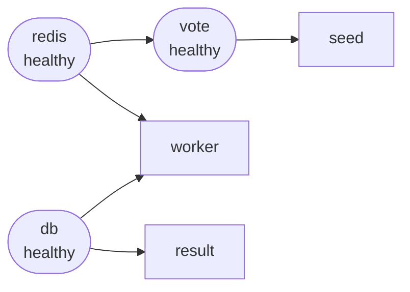

The Example Voting App uses Docker Compose health checks to enforce a safe startup order. Services only start after their dependencies have passed their health checks, preventing connection errors during initialisation.

<Note>
  Health checks are defined in `docker-compose.yml` only. The Docker Swarm stack (`docker-stack.yml`) does not include health checks or `depends_on` conditions.
</Note>

## Startup dependency chain

The `depends_on` conditions in `docker-compose.yml` form a strict startup chain:



| Service | Waits for              | Condition         |
|---------|------------------------|-------------------|
| vote    | redis                  | `service_healthy` |
| result  | db                     | `service_healthy` |
| worker  | redis, db              | `service_healthy` |
| seed    | vote                   | `service_healthy` |

This means:
- **redis** must be healthy before `vote` or `worker` start.
- **db** must be healthy before `result` or `worker` start.
- **vote** must be healthy before the optional `seed` service starts.

## Service health checks

### vote

The vote service uses `curl` to verify the Flask/Gunicorn HTTP server is accepting requests:

```yaml docker-compose.yml
vote:
  healthcheck:
    test: ["CMD", "curl", "-f", "http://localhost"]
    interval: 15s
    timeout: 5s
    retries: 3
    start_period: 10s
```

| Parameter      | Value | Meaning                                                   |
|----------------|-------|-----------------------------------------------------------|
| `interval`     | 15s   | How often Docker runs the check after the start period    |
| `timeout`      | 5s    | Maximum time allowed for a single check to complete       |
| `retries`      | 3     | Consecutive failures before the container is marked unhealthy |
| `start_period` | 10s   | Grace period before failed checks count against the retry limit |

The `curl -f` flag causes the command to exit with a non-zero status on HTTP error responses (4xx, 5xx), so the check fails if the app is running but returning errors.

<Note>
  `curl` is explicitly installed in the vote `Dockerfile` (`apt-get install -y curl`) so this command is always available inside the container.
</Note>

### redis

Redis health is verified by a shell script mounted from the host:

```yaml docker-compose.yml
redis:
  image: redis:alpine
  volumes:
    - "./healthchecks:/healthchecks"
  healthcheck:
    test: /healthchecks/redis.sh
    interval: "5s"
```

**`healthchecks/redis.sh`**

```shell
#!/bin/sh
set -eo pipefail

host="$(hostname -i || echo '127.0.0.1')"

if ping="$(redis-cli -h "$host" ping)" && [ "$ping" = 'PONG' ]; then
    exit 0
fi

exit 1
```

The script resolves the container's own IP address, then sends a `PING` command using `redis-cli`. Redis returns `PONG` when it is ready to serve requests. The script exits `0` on success and `1` on failure.

### db (PostgreSQL)

PostgreSQL health is verified by a similar shell script:

```yaml docker-compose.yml
db:
  image: postgres:15-alpine
  volumes:
    - "./healthchecks:/healthchecks"
  healthcheck:
    test: /healthchecks/postgres.sh
    interval: "5s"
```

**`healthchecks/postgres.sh`**

```shell
#!/bin/bash
set -eo pipefail

host="$(hostname -i || echo '127.0.0.1')"
user="${POSTGRES_USER:-postgres}"
db="${POSTGRES_DB:-$POSTGRES_USER}"
export PGPASSWORD="${POSTGRES_PASSWORD:-}"

args=(
    # force postgres to not use the local unix socket (test "external" connectibility)
    --host "$host"
    --username "$user"
    --dbname "$db"
    --quiet --no-align --tuples-only
)

if select="$(echo 'SELECT 1' | psql "${args[@]}")" && [ "$select" = '1' ]; then
    exit 0
fi

exit 1
```

The script connects to PostgreSQL over TCP (not the Unix socket) and runs `SELECT 1`. This verifies that the database process is fully initialised and can accept connections from other containers — not just the local socket, which becomes available earlier in the startup sequence.

It reads `POSTGRES_USER`, `POSTGRES_DB`, and `POSTGRES_PASSWORD` from environment variables, falling back to `postgres` if they are not set.

<Tip>
  Both scripts are mounted as a volume from `./healthchecks` into each service container. This means you can update the scripts without rebuilding images.
</Tip>

## How `depends_on` uses health checks

Setting `condition: service_healthy` in a `depends_on` block tells Compose to wait until the dependency's health check passes before starting the dependent service:

```yaml docker-compose.yml
worker:
  build:
    context: ./worker
  depends_on:
    redis:
      condition: service_healthy
    db:
      condition: service_healthy
  networks:
    - back-tier
```

Without this, the worker could attempt to connect to Redis or PostgreSQL before they are ready, causing startup failures.
