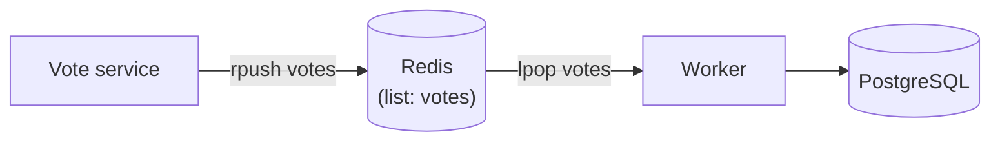

Redis serves as the transient message queue in the voting pipeline. The Vote service appends each incoming vote to a Redis list; the Worker drains that list and writes to PostgreSQL. Redis holds votes only while they are in-flight — there is no persistent volume.

## Overview

<CardGroup cols={2}>
  <Card title="Image" icon="box">
    `redis:alpine`
  </Card>
  <Card title="Data structure" icon="list">
    List named `votes`
  </Card>
  <Card title="Persistence" icon="ban">
    None — data is transient
  </Card>
  <Card title="Network" icon="network-wired">
    `back-tier` only
  </Card>
</CardGroup>

## Role in the data pipeline



| Operation | Service | Command              | Description                              |
|-----------|---------|----------------------|------------------------------------------|
| Write     | Vote    | `rpush votes <json>` | Appends a JSON vote object to the list   |
| Read      | Worker  | `ListLeftPopAsync("votes")` | Removes and returns the oldest entry |

The list acts as a FIFO queue: votes are pushed to the right (`rpush`) and popped from the left (`lpop`), preserving submission order.

## Vote message format

Each entry in the `votes` list is a JSON string:

```json
{"voter_id": "a3f9c2d81b74e650", "vote": "a"}
```

| Field      | Type   | Description                               |
|------------|--------|-------------------------------------------|
| `voter_id` | string | Hex 64-bit random ID from the voter cookie |
| `vote`     | string | `"a"` or `"b"` corresponding to each option |

## Configuration

```yaml docker-compose.yml
redis:
  image: redis:alpine
  volumes:
    - "./healthchecks:/healthchecks"
  healthcheck:
    test: /healthchecks/redis.sh
    interval: "5s"
  networks:
    - back-tier
```

<Note>
  Redis has no persistent volume. If the container restarts, any votes that have been pushed but not yet processed by the Worker will be lost.
</Note>

## Health check

The health check mounts the `healthchecks/` directory into the container and runs `redis.sh` every 5 seconds.

```bash healthchecks/redis.sh
#!/bin/sh
set -eo pipefail

host="$(hostname -i || echo '127.0.0.1')"

if ping="$(redis-cli -h "$host" ping)" && [ "$ping" = 'PONG' ]; then
	exit 0
fi

exit 1
```

The script connects to Redis using the container's IP address (rather than `localhost`) and issues a `PING` command. A `PONG` response indicates a healthy service.

| Parameter  | Value | Description                     |
|------------|-------|---------------------------------|
| `interval` | 5s    | Time between health checks      |

<Tip>
  Both the Vote and Worker services declare `depends_on: redis: condition: service_healthy` in `docker-compose.yml`, so they will not start until this health check passes.
</Tip>

## Networks

Redis is on the `back-tier` network only. It is reachable by:

- **Vote service** — also on `back-tier`, connects via hostname `redis`
- **Worker** — on `back-tier`, connects via hostname `redis`

<Warning>
  Redis is not on the `front-tier` network and is not accessible directly from the host.
</Warning>

## No persistent storage

Redis is intentionally configured without a volume mount for its data directory. Votes in the queue are transient: once the Worker calls `lpop` and writes the result to PostgreSQL, the data exists only in the database. This design keeps the queue lightweight and avoids the complexity of Redis persistence configuration.
